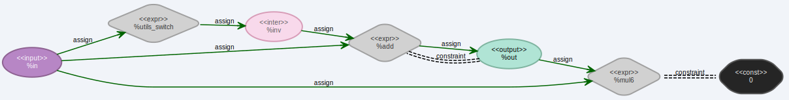

# ProoFuzz

- [Doc](./doc/)
- [Meeting Notes](./NOTE.md)

## Build

- circom2llvm

```bash
$ cargo build --bin=circom2llvm --package=circom2llvm --release
# sudo cp ./target/release/circom2llvm /usr/local/bin/circom2llvm
```

- zkap

```bash
cd zkap/detectors
sh ./build.sh
```

- proofuzz

```bash
cd proofuzz
sh ./build.sh
```


## Example

```bash
# compile circom to llvm ir
$ circom2llvm --input ./benchmark/sample/iszero_safe.circom --output ./benchmark/sample/
```

- Visualization

```bash
$ opt -enable-new-pm=0 -load ./proofuzz/build/libProoFuzzPass.so --ExtendedPrintGraphviz -S ./benchmark/sample/iszero_safe.ll -o /dev/null 2> ./benchmark/sample/iszero_safe.dot
```




- Execution

```bash
# compile circom to llvm ir
$ circom2llvm --input ./benchmark/sample/iszero_vuln.circom --output ./benchmark/sample/

# modify .ll file 
$ opt -enable-new-pm=0 -load ./proofuzz/build/libProoFuzzPass.so  --InitializeConstraintPass --MainAdderPass --enable-overwrite-free-variables --printout-outputs --printout-constraints -S ./benchmark/sample/iszero_vuln.ll -o ./benchmark/sample/iszero_vuln_overwritten.ll

# link .ll files
$ llvm-link ./benchmark/sample/iszero_vuln_overwritten.ll ../circom2llvm/utils/field_operations.ll -o ./benchmark/sample/iszero_vuln_overwritten_linked.ll

# execute .ll file
$ lli ./benchmark/sample/iszero_vuln_overwritten_linked.ll
1     # <-- lower bits of the input `in`
0     # <-- higher bits of the input `in`
0     # <-- lower bits of the intermediate variable `inv`
0     # <-- higher bits of the intermediate variable `inv`
1     # <-- lower bits of the output `out` of the modified circuit 
0     # <-- higher bits of the output `out` of the modified circuit
1     # <-- whether all of the constraints is met in the modified circuit
0     # <-- lower bits of the output `out` of the original circuit 
0     # <-- higher bits of the output `out` of the original circuit 
1     # <-- whether all of the constraints is met in the modified circuit
Error: Under-Constraint-Condition Met. Terminating program.
```