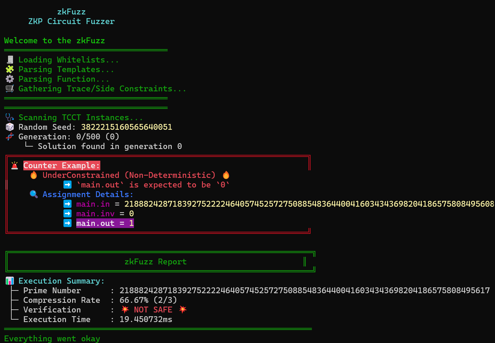
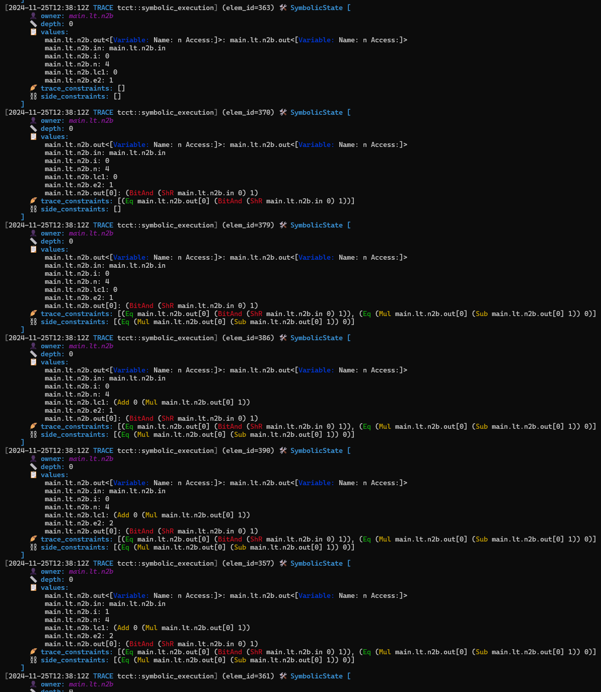

# Trace-Constraint Consistency Test (TCCT)

This tool is designed to extract and analyze the trace constraints ($`\mathcal{T}(\mathcal{P})`$) and side constraints ($`\mathcal{S}(\mathcal{C})`$) from ZKP circuits written in Circom.

## Build

To compile the tool, run:

```bash
cargo build
or
cargo build --release
```

## Usage

```
ZKP Circuit Debugger

USAGE:
    tcct [FLAGS] [OPTIONS] [--] [input]

FLAGS:
        --constraint_assert_dissabled    Does not add asserts in the generated code for === constraint equalities
    -h, --help                           Prints help information
        --show_stats_of_ast              (TCCT) Prints the basic stats of AST
    -V, --version                        Prints version information
        --print_ast                      (TCCT) Prints AST
        --print_stats                    (TCCT) Prints the stats of constraints
        --print_stats_csv                (TCCT) Prints the stats of constraints in CSV format
        --symbolic_template_params       (TCCT) Treats the template parameters of the main template as symbolic values
        --save_output                    (TCCT) Save the output when the counterexample is found

OPTIONS:
    -p, --prime <prime>
            To choose the prime number to use to generate the circuit. Receives the name of the curve (bn128, bls12381,
            goldilocks, grumpkin, pallas, vesta, secq256r1) [default: bn128]
    -l <link_libraries>...                                       Adds directory to library search path
        --search_mode <search_mode>
            (TCCT) Search mode to find the counter example that shows the given circuit is not well-constrained
            [default: none]
        --path_to_mutation_setting <path_to_mutation_setting>
            (TCCT) Path to the setting file for Mutation Testing [default: none]

        --path_to_whitelist <path_to_whitelist>                  (TCCT) Path to the white-lists file [default: none]
        --debug_prime <debug_prime>
            (TCCT) Prime number for TCCT debugging [default:
            21888242871839275222246405745257275088548364400416034343698204186575808495617]
        --heuristics_range <heuristics_range>
            (TCCT) Heuristics range for TCCT debugging [default: 100]


ARGS:
    <input>    Path to a circuit with a main component [default: ./circuit.circom]
```

**Example Command:**

```bash
./target/debug/tcct ./tests/sample/iszero_vuln.circom --search_mode="ga"
or
./target/release/tcct ./tests/sample/iszero_vuln.circom --search_mode="ga"
```

**Example Output:**



If `--save_output` option is on, the counterexample is saved on the same directory when the counterexample is found.

**Example Command with `--save_output`**

```bash
./target/release/tcct ./tests/sample/test_vuln_iszero.circom --search_mode="ga" --save_output
```

**Example Output:**

```s
  ████████╗ ██████╗ ██████╗████████╗
  ╚══██╔══╝██╔════╝██╔════╝╚══██╔══╝
     ██║   ██║     ██║        ██║
     ██║   ██║     ██║        ██║
     ██║   ╚██████╗╚██████╗   ██║
     ╚═╝    ╚═════╝ ╚═════╝   ╚═╝
 Trace-Constraint Consistency Test
     ZKP Circuit Debugger v0.0

Welcome to the TCCT Debugging Tool
════════════════════════════════════════════════════════════════
🧾 Loading Whitelists...
🧩 Parsing Templates...
⚙️ Parsing Function...
🛒 Gathering Trace/Side Constraints...
════════════════════════════════════════════════════════════════
════════════════════════════════════════════════════════════════
🩺 Scanning TCCT Instances...
🎲 Random Seed: 13057132941229430025
🧬 Generation: 7/300 (0)
    └─ Solution found in generation 7
💾 Saving the output to: ./tests/sample/test_vuln_iszero.circom_j9BXuA9k1j_counterexample.json
╔══════════════════════════════════════════════════════════════╗
║🚨 Counter Example:                                           ║
║    🔥 UnderConstrained (Non-Deterministic) 🔥
║           ➡️ `main.out` is expected to be `0`
║    🔍 Assignment Details:
║           ➡️ main.in = 21888242871839275222246405745257275088548364400416034343698204186575808495524
║           ➡️ main.inv = 0
║           ➡️ main.out = 1
╚══════════════════════════════════════════════════════════════╝

╔═══════════════════════════════════════════════════════════════╗
║                        TCCT Report                            ║
╚═══════════════════════════════════════════════════════════════╝
📊 Execution Summary:
 ├─ Prime Number      : 21888242871839275222246405745257275088548364400416034343698204186575808495617
 ├─ Compression Rate  : 66.67% (2/3)
 ├─ Verification      : 💥 NOT SAFE 💥
 └─ Execution Time    : 36.4972ms
════════════════════════════════════════════════════════════════
Everything went okay
```

This tool also provides multiple verbosity levels for detailed analysis with the environmental variable `RUST_LOG`:

- `warn`: Outputs warnings and errors.
- `info`: Includes everything from `warn` and adds the basic statistics about the trace and constraints.
- `debug`: Includes everything from `info` and adds the trace of the final state.
- `trace`: Includes everything from `debug` and outputs all intermediate trace states during execution.

**Example Command with Verbosity:**

```bash
RUST_LOG=trace ./target/debug/tcct ../sample/lessthan3.circom --print_ast --print_stats
```

**Example Output:**

<div style="display: flex; align-items: flex-start; justify-content: space-around;">
  
  
  
</div>

