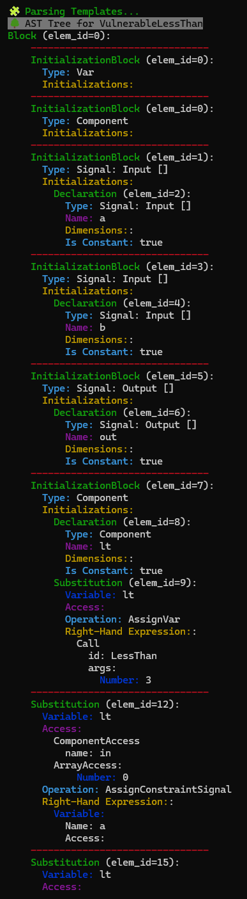
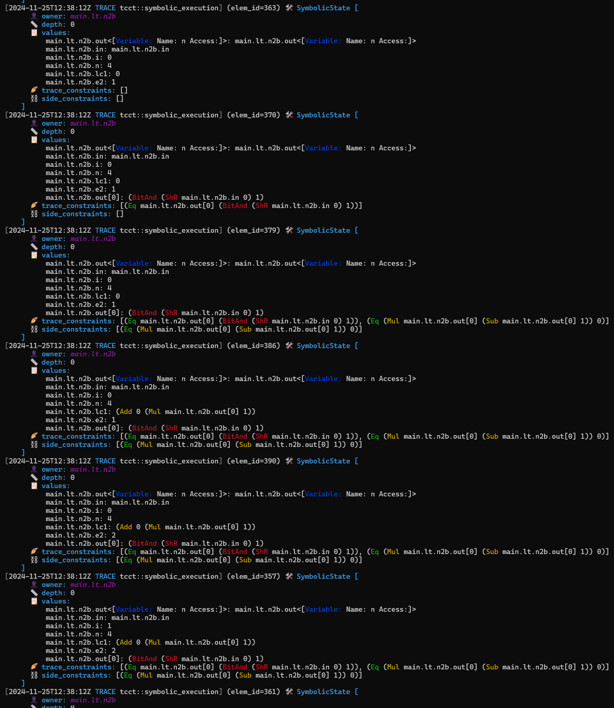
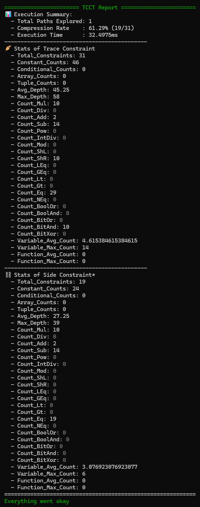

# Trace-Constraint Consistency Test (TCCT)

This tool is designed to extract and analyze the trace constraints ($`\mathcal{T}(\mathcal{P})`$) and side constraints ($`\mathcal{S}(\mathcal{C})`$) from ZKP circuits written in Circom.

## Build

To compile the tool, run:

```bash
cargo build
```

## Usage Example

TCCT provides multiple verbosity levels for detailed analysis:

- `warn`: Outputs warnings and basic statistics about the trace and side constraints.
- `info`: Includes everything from `warn` and adds details about all possible finite states.
- `debug`: Includes everything from `info` and adds the full AST (Abstract Syntax Tree).
- `trace`: Includes everything from `debug` and outputs all intermediate trace states during execution.

To analyze a sample Circom circuit, use the following command:

```bash
RUST_LOG=trace ./target/debug/tcct ../sample/iszero_safe.circom
```

Example output:

<div style="display: flex; align-items: flex-start; justify-content: space-around;">
  
  
  
</div>

